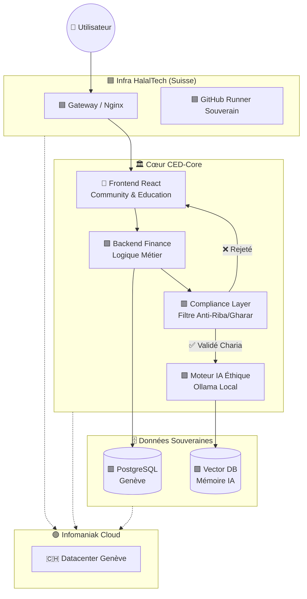

> 🗺️ **Retour à l'index central :** [Voir l'écosystème complet CED HalalTech™](https://github.com/PrettyhowQ/ced-master-index)

# 🟦 CED-Core | Infra HalalTech
> 🏛️ **Autorité Constitutionnelle** : Ce dépôt de production est strictement soumis à la Constitution Éthique de l'écosystème : **[CED-Umm-AL-Mashari](https://github.com/PrettyhowQ/CED-Umm-AL-Mashari)**.
>
> Toute fonctionnalité, tout déploiement et toute modification doivent respecter les **6 Piliers** (Wasatiyyah, Sobriété, Finance Halale).
> Ce code est "purifié" par le laboratoire **YasCoder** avant d'arriver ici.

---

> **🇨🇭 Écosystème Financier & Technologique Conforme Sharia**  
> 📍 **Localisation :** Genève, Suisse (Hébergé 100% chez Infomaniak)  
> 🔒 **Conformité :** LPD / RGPD / AAOIFI (Zéro Riba, Zéro Gharar)  
> 🚀 **Statut :** Production | Version: `2.4.1-AUDITED`

---

## 🌟 Fondation Spirituelle & Éthique (Niyyah)

> *"Je ne cherche par ce projet que la Face d'Allah, et non la renommée, ni le gain mondain."*

Ce projet est guidé par une **Déclaration d'Intention (Niyyah)** stricte : servir uniquement la Face d'Allah, dans la sincérité (*Ikhlas*) et le bénéfice pour la communauté (*Nafa'*).

*   ✅ **Tawhîd :** Unicité de la vision technique et spirituelle.
*   ✅ **'Adl :** Justice et équité intégrées dans les algorithmes.
*   ✅ **Amanah :** Gestion responsable et sécurisée des données utilisateurs.

---

## 🎨 Charte Visuelle & Architecture (Infra HalalTech)

Pour une maintenance claire et une cohérence spirituelle, chaque module de ce dépôt respecte le **Code Couleur Souverain**. Cette charte s'applique à la fois à la documentation et à la structure des dossiers dans le code.

| Couleur | Pôle | Entité | Usage dans le code |
| :--- | :--- | :--- | :--- |
| 🟦 **Bleu Marine** | Infra | Infra HalalTech | Config racine, Docker, CI/CD, DevOps (`.github`, `docker-compose`). |
| 🟩 **Vert** | Finance | CED HalalTech | Modules financiers, Zakat, Fiqh, Takaful (`server/finance`, `shared/schema`). |
| 🟧 **Orange** | Formation | Institut Yamina | LMS, Cours, Recherche (`client/src/components/education`). |
| 🟪 **Violet** | IA | EuriaHub CED | Algorithmes éthiques, IA, Filtres RAG (`server/ai`, `scripts/python`). |
| 🔷 **Turquoise** | Communauté | Club Empreinte | Forum, Utilisateurs, Événements (`client/src/components/community`). |
| 🟥 **Rouge** | Suisse | Genève / Légal | Conformité LPD, Lois locales, Logs d'audit (`docs/legal`, `server/compliance`). |
| 🟢 **Vert Pistache** | Hébergeur | Infomaniak | Scripts de déploiement, Variables d'env, SSH (`.env`, `deploy.sh`). |
| ⚪ **Beige** | Éthique | Transverse | Documentation, Manifestes, Licences (`LICENSE`, `MANIFESTE_ETHIQUE.md`). |
| 📺 **Média** | PRETTYHOWQ | Web TV & Streaming | Composants vidéo (`client/src/media`). |
| 📞 **Com** | Téléphonie | Standard & Appels | Intégration VoIP (`server/telephony`). |

---

## 🏗️ Architecture Technique

Une stack moderne, performante et 100% souveraine, conçue pour l'excellence (*Ihsan*).

🧪 Module Pilote : Formation & Intégration (Institut Yamina 🟧)

Dans le cadre du programme de formation de l'Institut Yakoubi Yamina, ce dépôt accueille des modules pilotes développés par nos apprentis sous supervision stricte.

🟩 Projet Actif : Calculateur de Zakat al-Mal (v1.0)

Objectif : Fournir un outil de calcul précis, local et éthique pour la communauté.
Emplacement : /server/finance/zakat & /client/src/components/finance
Stack : TypeScript, TailwindCSS (Vert #10B981).
Éthique :
✅ Confidentialité (Amanah) : Calcul côté client (Zero-Knowledge).
✅ Précision ('Adl) : Algorithmes audités (2.5% exact).
Statut : En développement pour le test technique des nouveaux candidats (Promo 2026).
🤲 Comment Contribuer ? (Guide Spirituel & Technique)

Contribuer à ced-noyau n'est pas un acte technique ordinaire, c'est une Amanah (dépôt de confiance). Chaque ligne de code ajoutée doit respecter notre engagement envers Allah, l'humanité et la souveraineté numérique.

1. Avant de Coder : La Niyyah (Intention)

Réfléchissez : Pourquoi cette fonctionnalité est-elle nécessaire ? Sert-elle le bien commun (Nafa') ?
Purifiez : Assurez-vous que votre intention est sincère (Ikhlas), loin de l'orgueil ou de la simple recherche de profit.
Déclarez : Si vous ajoutez un module majeur, créez ou mettez à jour le fichier NIYYAH.md dans le dossier concerné.
2. Le Développement : Excellence (Ihsan) & Éthique

Code Propre : Suivez les standards TypeScript/React. Un code laid est un code difficile à maintenir.
Respect de la Charte : Utilisez les couleurs et structures définies (ex: /server/finance pour le Vert, /client/src/education pour l'Orange).
Zéro Riba/Gharar : Vérifiez qu'aucune logique financière ne contourne les principes de la Charia.
Souveraineté : Aucune donnée ne doit être envoyée vers des serveurs hors Suisse (sauf exception validée).
3. La Submission (Pull Request)

Tests : Assurez-vous que tous les tests passent localement.
Audit Éthique : Le "Gardien Éthique" (CI/CD) vérifiera automatiquement votre code. S'il échoue, corrigez avec humilité.
Message de Commit : Soyez clair et honnête. Ex: feat(zakat): ajout calcul précis selon école Maliki.
4. Après le Merge : Gratitude (Shukr)

Une fois votre code fusionné, prenez un moment pour remercier Allah d'avoir facilité ce travail.
Sachez que chaque utilisateur qui bénéficiera de votre code générera une récompense perpétuelle (Sadaqa Jariya) pour vous, incha Allah.
"Celui qui introduit une bonne tradition en Islam aura sa récompense et celle de tous ceux qui la suivront..." (Muslim)

Merci de faire partie de cette aventure unique. Qu'Allah bénisse vos mains et votre code.

